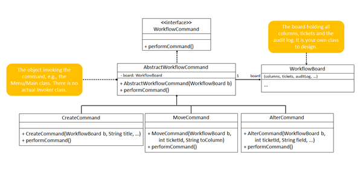

# Task 1: Workflow Commands

## Overview
User stories are used in the Agile software development approach to describe a piece of functionality that needs to be developed as part of a larger system from the end user’s perspective. See more information about user stories and the Agile process [here](https://www.atlassian.com/agile/project-management/user-stories) and [here](https://agilealliance.org/glossary/user-stories/).

A user story can be logged using a ticket on a board that has columns representing different ticket states, for example To Do, In Progress and Done.

For this task, a newly-formed company called **ManageMyWorkflow** has asked you, as a junior software developer, to create a **workflow management system** to manage the states of user stories within a software development project.

Your task is to implement the **backend functionality** of this system using a **console menu–based Java application**.

---

## Commands

You must implement code for the following commands:

### 1. Create
Creates a ticket and adds it to the **To Do** column.

### 2. Move
Moves a ticket from one column to another column.

### 3. Alter
Adds or edits specific information of a ticket.

---

## Ticket States

Tickets can move between the following three states:

- **To Do**
- **In Progress**
- **Done**

Information must be stored for each ticket so that its **current state** in the system is always known.

## Ticket Information

A Ticket must store:

- id
- title
- description
- priority
- status

Statuses should be set using a public enum (i.e., Status.TO_DO, Status.IN_PROGRESS and Status.DONE) in the `workflow` package.

---

## Audit Log

You must implement an **audit log** that keeps a history of all commands performed in the system. 

You can see an interactive example of a software development board [here](https://gemini.google.com/share/7e1779fd9b8c).

---

# Minimum Viable Product (MVP) Requirements

Implement the console-menu-based application as a minimal viable product (MVP) to show the stakeholders of your company. The MVP should have the following functionality:

1. **Audit Log Data Structure**  
   A data structure that is initially empty to represent the audit log.

2. **Command Execution**  
   All commands (Create, Move and Alter) must be supported.  
   The user must be able to specify details for each command, for example:
    - Which ticket to modify
    - Which column to move the ticket to
    - What information to update

3. **Multiple Commands per Ticket**  
   A single ticket may have **multiple commands performed on it**. Each command must be recorded as a **separate entry in the audit log**.   

4. **Debug Display**  
   After **every command**, display the contents of all columns for debugging purposes.

5. **Audit Log Display**  
   The system must allow the user to **display the audit log**.

---

# UML Class Diagram

The Java classes in your solution **must match the following UML class diagram**:

---

## Important Notes

The UML diagram **may not contain all fields and methods** required for the system, e.g., constructors, getters and setters.

When a command is **created**, it is **not executed immediately**.
To execute a command, the `performCommand()` method must be called.

The design shown in the UML diagram resembles the **Command Design Pattern** and you can find more information on this pattern [here](https://en.wikipedia.org/wiki/Command_pattern).

### Constructor hints

| Command | Constructor signature |
|---------|---------------------|
| `CreateCommand` | `(WorkflowBoard board, String title)` |
| `MoveCommand` | `(WorkflowBoard board, int ticketId, Status newStatus)` — must also accept a `String` for the status (e.g. `"In Progress"`) |
| `AlterCommand` | `(WorkflowBoard board, int ticketId, String field, String value)` |

> **Tip:** `MoveCommand` is tested with both `Status.IN_PROGRESS` and the string `"In Progress"`. Make sure your constructor can handle both.

---

# Running the Project

## 1. Clone the Repository Using GitHub Desktop

1. Open **GitHub Desktop**.
2. Click **File → Clone Repository**.
3. Select the **URL** tab.
4. Paste the repository URL.
5. Choose a local folder where the project should be stored.
6. Click **Clone**.

The repository will now be downloaded to your computer.

---

## 2. Open the Project in IntelliJ IDEA

1. Open **IntelliJ IDEA**.
2. Click **Open** on the welcome screen.
3. Navigate to the folder where you cloned the repository.
4. Select the **project folder**.
5. Click **Open**.

IntelliJ will import the project.

If prompted:

- Select **Trust Project**
- Allow IntelliJ to **index and build** the project.

---

## 3. Run the Application

1. Locate the class containing the `main()` method.
2. Right-click the file.
3. Select **Run**.

The console menu interface should start, allowing you to perform commands such as:

- Create Ticket
- Move Ticket
- Alter Ticket
- View Board
- View Audit Log

### Note: You need to select 'Load Maven Project' to run the tests locally
Right-click on the test files in `src/test/java/workflow` to run specific tests

You can also run the tests via the Maven Tool Window:
1. Open the Maven Tool Window: View -> Tool Windows -> Maven
2. Run: Double-click on Lifecycle -> test

### Important: 
Add your code in the `src/main/java/workflow` package

---

# Expected Console Behaviour

After each command execution:

- The **board columns** should be displayed.
- The **ticket locations** should update accordingly.
- The **audit log** should store the command that was executed.

Example:

#### To Do:
[T1] Implement login feature

#### In Progress:
[T2] Design database schema

#### Done:
[T3] Setup project repository

---

# Note About Repository

* The repository contains automated tests and a starter `Main.java` console menu.

* The project will not compile until you implement the classes shown in the UML diagram.

* Required package name: workflow (see `src/main/java/workflow`)

* A `Main.java` file is provided with the console menu already built. Look for the `// TODO` comments — you just need to create and call your command objects.

---

# What Happens When You Push

Every push triggers **GitHub Actions autograding**. You can see your results in the **Actions** tab of your repository.

| Category | Tests | Points |
|----------|-------|--------|
| Structure | Classes, interfaces, and inheritance | 6 |
| Create Command | Creating tickets | 1 |
| Move Command | Moving tickets between columns | 2 |
| Alter Command | Modifying ticket fields | 1 |
| Audit Log | Logging every command | 1 |
| Robustness | Unique IDs, no duplicates, String status | 2 |
| Hidden tests (4) | Full workflow scenarios | 12 |
| **Total** | | **25** |

**Tips:**
- The **public tests** are in `src/test/java/workflow/` — read them to understand exactly what is expected.
- The **hidden tests** are not in the repository but they use the same constructors and methods as the public tests. If all public tests pass, the hidden tests should too.
- After each push, click the **Actions** tab, then click the latest run to see a **grade summary table** and detailed test output.

---

